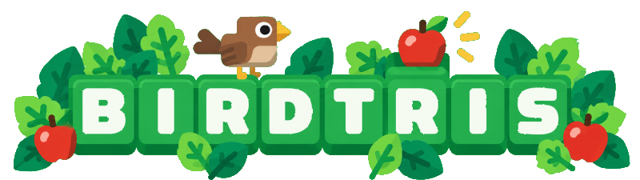
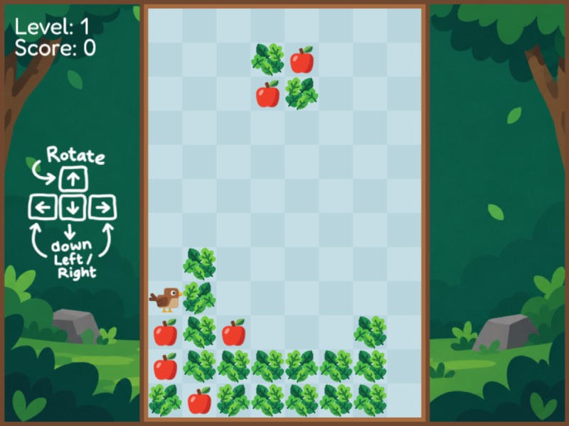

  

# Birdtris
Birdtris is a Tetris-style puzzle game with a twist: the birds on the board move on their own and try to eat fruit.

Place falling pieces to complete full rows and clear them, while helping the birds reach their fruit. As the game progresses, the level increases and the game gets faster.

This game was created entirely in java-script using the Phaser game engine.

  

## Gameplay

Birdtris combines traditional Tetris mechanics with its own gameplay elements:

- Falling pieces can contain birds, apples, leaves, and logs.
- Complete full rows to clear them and earn points.
- Birds move around the board automatically.
- Birds eat nearby apples for bonus points.
- Birds can get stuck and disappear after spending too long without making progress.
- The game gets faster as the level increases.
- The game ends when a new piece can no longer be spawned.

## Controls

| Key | Action |
|-----|--------|
| ← → | Move piece |
| ↓ | Move piece down |
| ↑ | Rotate piece |

## Tech Stack

- **JavaScript** – Game logic and mechanics
- **Phaser 3** – Game framework and rendering
- **HTML5** – Page structure and game container
- **CSS** – Font and basic page styling

The game is built with JavaScript and Phaser 3, without additional game-development frameworks or engines.
